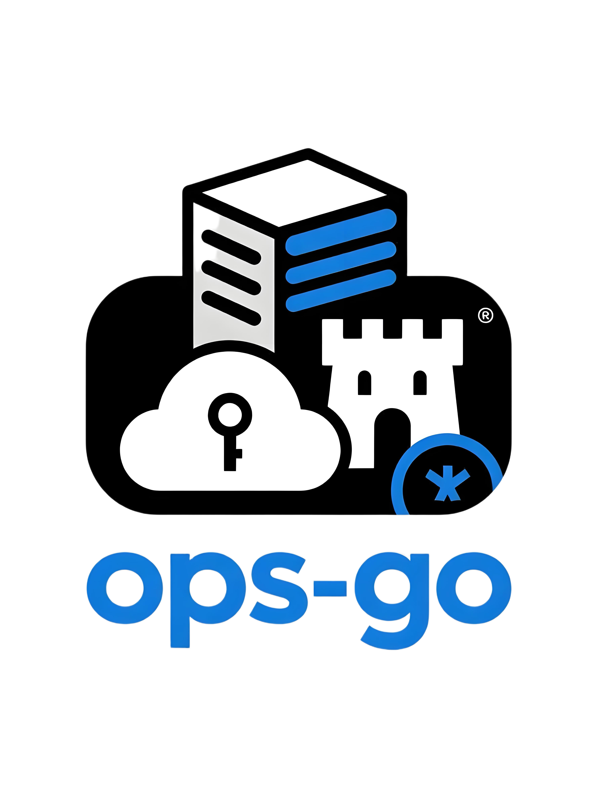

<div align="center">
	
	<p align="center">
		<a href="https://v3.vuejs.org/" target="_blank">
			
		</a>
		<a href="https://element-plus.gitee.io/#/zh-CN/component/changelog" target="_blank">
			
		</a>
		<a href="https://www.tslang.cn/" target="_blank">
	    
	  </a>
		<a href="https://vitejs.dev/" target="_blank">
		  
		</a>
		<a href="https://github.com/zhany/ops-go" target="_blank">
		  
		</a>
	</p>
	<p>&nbsp;</p>
</div>

## 🌈 项目介绍

Ops-Go UI 是 Ops-Go 运维管理系统的前端项目，基于 Vue 3 + TypeScript + Vite + Element Plus 技术栈构建。提供现代化的用户界面，支持主机管理、Web Terminal、会话审计、权限管理等功能。

### 核心特性

- 🖥️ **Web Terminal** - 基于 xterm.js 的浏览器 SSH 终端，支持完整的终端交互
- 📹 **会话录像回放** - 使用 asciinema-player 进行会话录像的在线回放
- 🎨 **现代化 UI** - 基于 Element Plus 2.x 的美观界面设计
- 🔐 **权限控制** - 精细的按钮级权限控制
- 📱 **响应式设计** - 适配桌面、平板等多种设备
- ⚡ **高性能** - Vite 构建，支持热更新和快速开发
- 🌍 **国际化** - 内置 i18n 多语言支持

---

## 🚧 环境要求

| Node.js | npm/pnpm | 浏览器 |
|---------|----------|--------|
| ≥ 16.0.0 | ≥ 7.0.0 | Chrome ≥ 87 / Edge ≥ 88 / Firefox ≥ 78 / Safari ≥ 13 |

---

## ⚡ 快速开始

### 1. 克隆项目

```bash
git clone https://github.com/zhany/ops-go-ui.git
cd ops-go-ui
```

### 2. 安装依赖

```bash
# 使用 npm
npm install

# 或使用 cnpm
cnpm install

# 或使用 pnpm（推荐）
pnpm install
```

### 3. 配置环境变量

项目包含三个环境配置文件：

- `.env.development` - 开发环境
- `.env.production` - 生产环境
- `.env` - 默认配置

开发环境配置示例（`.env.development`）：

```env
# 环境标识
ENV = development

# 本地环境接口地址
VITE_API_URL = http://localhost:8080

# 端口
VITE_PORT = 3000

# 是否自动打开浏览器
VITE_OPEN = true

# 是否开启 CDN
VITE_OPEN_CDN = false

# 打包路径
VITE_PUBLIC_PATH = /
```

### 4. 启动开发服务器

```bash
npm run dev
```

启动成功后，浏览器会自动打开 `http://localhost:3000`

### 5. 构建生产版本

```bash
npm run build
```

构建产物将输出到 `dist` 目录。

---

## 📚 项目结构

```
ops-go-ui/
├── public/                    # 静态资源
├── src/                       # 源代码目录
│   ├── api/                   # API 接口定义
│   │   ├── dept/             # 部门管理接口
│   │   ├── group/            # 分组管理接口
│   │   ├── instance/         # 主机管理接口
│   │   ├── keys/             # 凭证管理接口
│   │   ├── log/              # 日志管理接口
│   │   ├── login/            # 登录接口
│   │   ├── menu/             # 菜单管理接口
│   │   ├── myinstance/       # 我的主机接口
│   │   ├── role/             # 角色管理接口
│   │   ├── terminal/         # 终端相关接口
│   │   └── user/             # 用户管理接口
│   ├── assets/               # 资源文件
│   ├── components/           # 公共组件
│   │   ├── auth/             # 权限组件
│   │   ├── cropper/          # 图片裁剪
│   │   ├── editor/           # 富文本编辑器
│   │   ├── iconSelector/     # 图标选择器
│   │   ├── noticeBar/        # 通知栏
│   │   ├── svgIcon/          # SVG 图标
│   │   ├── table/            # 表格组件
│   │   └── watermark/        # 水印组件
│   ├── directive/            # 自定义指令
│   ├── i18n/                 # 国际化
│   ├── layout/               # 布局组件
│   │   ├── footer/           # 页脚
│   │   ├── lockScreen/       # 锁屏
│   │   ├── logo/             # Logo
│   │   ├── main/             # 主体布局
│   │   ├── navBars/          # 顶部导航
│   │   ├── navMenu/          # 侧边菜单
│   │   └── routerView/       # 路由视图
│   ├── router/               # 路由配置
│   ├── stores/               # Pinia 状态管理
│   ├── theme/                # 主题样式
│   ├── types/                # TypeScript 类型定义
│   ├── utils/                # 工具函数
│   ├── views/                # 页面组件
│   ├── App.vue               # 根组件
│   └── main.ts               # 入口文件
├── .env                      # 环境变量
├── .env.development          # 开发环境配置
├── .env.production           # 生产环境配置
├── .eslintrc.js              # ESLint 配置
├── .prettierrc.js            # Prettier 配置
├── index.html                # HTML 模板
├── package.json              # 项目依赖
├── tsconfig.json             # TypeScript 配置
├── vite.config.ts            # Vite 配置
└── README.md                 # 项目文档
```

---

## 🛠️ 技术栈

### 核心框架

| 技术 | 版本 | 说明 |
|------|------|------|
| Vue | 3.2+ | 渐进式 JavaScript 框架 |
| TypeScript | 5.0+ | JavaScript 超集 |
| Vite | 4.x | 下一代前端构建工具 |
| Vue Router | 4.x | 官方路由管理器 |
| Pinia | 2.x | Vue 官方状态管理 |

### UI 组件

| 技术 | 版本 | 说明 |
|------|------|------|
| Element Plus | 2.3+ | Vue 3 组件库 |
| @element-plus/icons-vue | 2.1+ | Element Plus 图标库 |

### 终端与录像

| 技术 | 版本 | 说明 |
|------|------|------|
| xterm | 5.3+ | Web 终端模拟器 |
| xterm-addon-fit | 0.8+ | 终端自适应插件 |
| xterm-addon-web-links | 0.9+ | 终端链接插件 |

### 工具库

| 技术 | 说明 |
|------|------|
| Axios | HTTP 客户端 |
| Echarts | 图表库 |
| echarts-gl | 3D 图表 |
| js-cookie | Cookie 操作 |
| jsencrypt | RSA 加密 |
| nprogress | 进度条 |
| screenfull | 全屏切换 |
| mitt | 事件总线 |
| qrcodejs2-fixes | 二维码生成 |
| sortablejs | 拖拽排序 |
| vue-clipboard3 | 剪贴板操作 |

### 开发工具

| 技术 | 说明 |
|------|------|
| ESLint | 代码检查 |
| Prettier | 代码格式化 |
| Sass | CSS 预处理器 |
| vite-plugin-compression | Gzip 压缩 |
| vite-plugin-vue-setup-extend-plus | 支持 setup name |

---

## 📖 主要功能模块

### 1. 用户管理
- 用户列表查询
- 用户增删改查
- 用户角色分配
- 用户状态管理

### 2. 角色管理
- 角色列表查询
- 角色增删改查
- 角色权限配置
- 菜单权限分配

### 3. 主机管理
- 主机列表查询
- 主机信息编辑
- 主机状态管理
- 主机凭证绑定

### 4. 凭证管理
- 凭证列表查询
- 凭证增删改查
- 支持密码和密钥
- 凭证加密存储

### 5. Web Terminal
- 浏览器 SSH 连接
- 终端自适应大小（FitAddon 自动适配容器尺寸）
- 终端尺寸实时同步（连接时通过 WebSocket URL 参数传递初始尺寸，连接后通过 resize 消息实时同步窗口调整）
- 多终端标签页
- 复制粘贴支持
- 会话自动录制

### 6. 会话审计
- 会话列表查询
- 会话详情查看
- 录像在线回放
- 录像文件下载

### 7. 操作日志
- 操作日志查询
- 日志详情查看
- 时间范围筛选

---

## 🔧 开发指南

### 添加新页面

1. 在 `src/views/` 下创建页面组件
2. 在 `src/router/route.ts` 中添加路由配置
3. 在 `src/api/` 中创建对应的 API 接口
4. 在后端菜单管理中配置菜单项

### 添加 API 接口

在 `src/api/` 目录下创建接口文件：

```typescript
// src/api/example.ts
import request from '/@/utils/request';

/**
 * 获取列表
 */
export const getList = (params: any) => {
	return request({
		url: '/example/list',
		method: 'get',
		params,
	});
};

/**
 * 创建
 */
export const create = (data: any) => {
	return request({
		url: '/example/create',
		method: 'post',
		data,
	});
};
```

### 使用 Pinia Store

```typescript
import { defineStore } from 'pinia';

export const useExampleStore = defineStore('example', {
	state: () => ({
		count: 0,
	}),
	actions: {
		increment() {
			this.count++;
		},
	},
});
```

### 自定义指令

项目已包含自定义指令，使用方式：

```vue
<!-- 权限指令 -->
<el-button v-auth="'user:add'">添加用户</el-button>

<!-- 防抖指令 -->
<el-button v-debounce="handleClick">点击</el-button>

<!-- 节流指令 -->
<el-button v-throttle="handleClick">点击</el-button>
```

---

## 🎨 主题定制

### 修改主题色

在 `src/theme/element.scss` 中修改 Element Plus 主题变量：

```scss
@forward 'element-plus/theme-chalk/src/common/var.scss' with (
  $colors: (
    'primary': (
      'base': #409eff,
    ),
  ),
);
```

### 自定义主题

在 `src/theme/app.scss` 中可以自定义应用主题：

```scss
// 自定义主题色
$bg-color: #ffffff;
$text-color: #303133;
```

---

## 📦 构建优化

### CDN 加速

修改 `.env` 文件中的 `VITE_OPEN_CDN` 为 `true`，在 `vite.config.ts` 中配置 CDN 地址。

### 代码分割

Vite 已配置自动代码分割，生产构建时会自动将依赖分离到独立的 chunk 文件。

### Gzip 压缩

项目已集成 `vite-plugin-compression`，构建时会自动生成 `.gz` 压缩文件。

---

## 🔐 安全建议

1. **生产环境配置**
   - 修改 `.env.production` 中的 API 地址
   - 启用 HTTPS
   - 配置正确的 CORS 策略

2. **代码安全**
   - 不要在前端存储敏感信息
   - 使用 HTTPS 传输数据
   - 定期更新依赖包

3. **权限控制**
   - 合理配置按钮级权限
   - 后端接口必须进行权限校验

---

## ❓ 常见问题

### 1. 安装依赖失败

```bash
# 清除缓存重新安装
rm -rf node_modules package-lock.json
npm install
```

### 2. 开发服务器启动失败

检查端口是否被占用，修改 `.env` 中的 `VITE_PORT`。

### 3. WebSocket 连接失败

检查 Vite 代理配置，确保 `ws: true` 已开启。

### 4. 终端无法连接

- 检查后端服务是否启动
- 确认 WebSocket 代理配置正确
- 查看浏览器控制台错误信息

### 5. 终端内容不换行 / 行宽异常

- 确认前后端均已部署最新版本（终端尺寸同步功能需要前后端同步更新）
- 强制刷新浏览器（`Ctrl+Shift+R`）确保加载最新前端资源
- 检查浏览器 DevTools → Network → WS，确认 WebSocket 连接 URL 中包含 `cols` 和 `rows` 参数
- 确认 SSH 连接成功后前端发送了 `resize` 类型消息

---

## 🤝 贡献指南

欢迎贡献代码！请遵循以下步骤：

1. Fork 本仓库
2. 创建特性分支 (`git checkout -b feature/AmazingFeature`)
3. 提交更改 (`git commit -m 'Add some AmazingFeature'`)
4. 推送到分支 (`git push origin feature/AmazingFeature`)
5. 提交 Pull Request

### 代码规范

- 遵循 Vue 3 官方风格指南
- 使用 TypeScript 进行类型检查
- 提交前运行 `npm run lint-fix` 修复代码格式问题

---

## 📄 许可证

本项目基于 [MIT](LICENSE) 许可证开源。

---

## 🔗 相关链接

- **后端项目**: [Ops-Go](https://github.com/zhany/ops-go)
- **Vue 3 文档**: [https://vuejs.org/](https://vuejs.org/)
- **Element Plus 文档**: [https://element-plus.org/](https://element-plus.org/)
- **Vite 文档**: [https://vitejs.dev/](https://vitejs.dev/)
- **xterm.js 文档**: [https://xtermjs.org/](https://xtermjs.org/)

---

## 👥 作者

- **Zhany_v** - [GitHub](https://github.com/zhany)

---

## 💖 致谢

感谢以下开源项目：

- [Vue.js](https://github.com/vuejs/vue)
- [Element Plus](https://github.com/element-plus/element-plus)
- [Vite](https://github.com/vitejs/vite)
- [xterm.js](https://github.com/xtermjs/xterm.js)
- [Pinia](https://github.com/vuejs/pinia)
- [vue-next-admin](https://gitee.com/lyt-top/vue-next-admin) - 本项目基于该模板二次开发

---

## 📮 联系方式

- **Issues**: [GitHub Issues](https://github.com/zhany/ops-go-ui/issues)
- **Email**: your-email@example.com

如果觉得项目不错，欢迎 Star 支持一下！
